# Step-by-Step Guide: Using OpenVelo to Autonomously Plan & Implement Features Inside Itself

This step-by-step guide demonstrates how to use OpenVelo to autonomously design, plan, build, and deploy new features *inside the OpenVelo repository itself*. By utilizing OpenVelo to plan changes to its own codebase, we showcase a complete self-hosting and autonomous development cycle.

---

## Step 1: Registering & Configuring OpenVelo as a Project

To have OpenVelo operate on its own codebase, we must first register it as a project in the OpenVelo Project Dashboard.

### 1.1 General Settings
Navigate to **New Project** and enter the configuration details:
- **Project Name**: `OpenVelo` (or a descriptive name for your self-hosting instance).
- **Repository URL & Host**: Select your repository host (in this example, a local **Gitea** instance) and supply the Git clone URL along with your Personal Access Token (PAT).
- **Working Branch**: Set the target branch for agent pull requests (e.g., `staging`).

[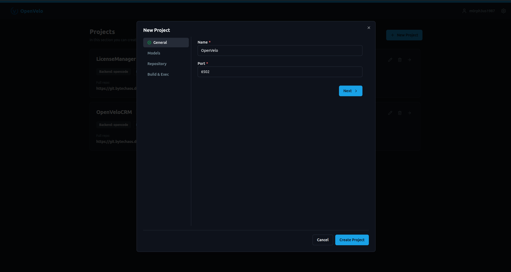](images/tutorial/01_00_General.png)

### 1.2 Model Allocation Settings
OpenVelo leverages a highly flexible multi-model architecture, allowing you to configure different LLM models for each phase of the planning and execution lifecycle. This lets you align specific task complexities with the optimal model:
- **Default Model**: The fallback model used across all phases when a stage-specific model is not explicitly configured.
- **Analyzer Model**: Powers the initial repository structure scanning, directory mapping, and standard orientation guide compilation (`REPOSITORY.md`).
- **Chat Model**: Powers the active requirements collection conversations, handling multi-turn user-system chat turns.
- **Requirement Model**: Powers logical checks, contradiction quizzes, non-functional gap assessments, and final `REQUIREMENT.MD` document synthesis.
- **Planning Model**: Powers backlog extraction, epic mapping, sequential dependency sorting, and coding conventions analysis.
- **Execution Model**: The core engine running inside the containerized agent environment to write code, adapt tests, and self-heal from test/review feedback.

[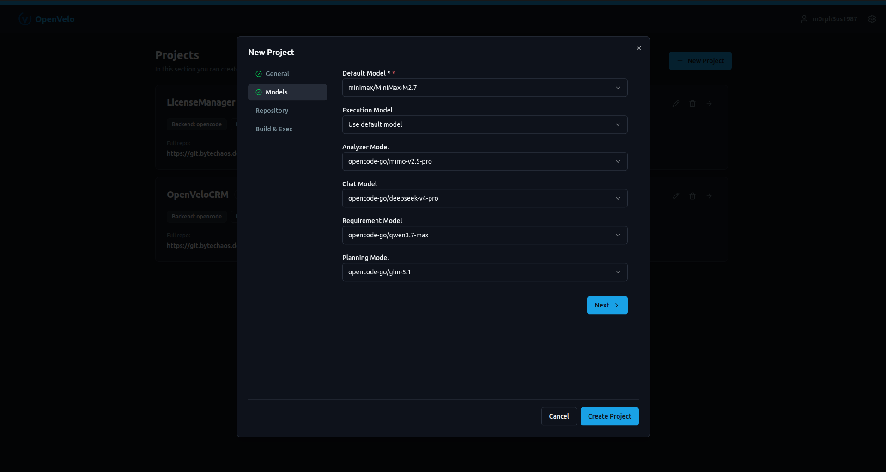](images/tutorial/01_01_Models.png)

### 1.3 Build and Unit Test Configuration
Set up the shell execution commands so containerized agents can build and verify the OpenVelo codebase:
- **Docker Image**: The environment in which tests will run (default: `openvelo-agent:linux`).
- **Build Command**: The shell command to build the project (e.g., `npm run build`).
- **Test Command**: The command to run the unit test suites (e.g., `npm test`).
- **Remove Deleted Containers**: Enabled by default to clean up host disk space after job completion.

[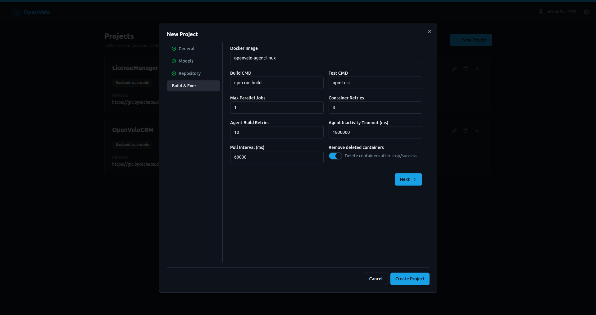](images/tutorial/01_02_Build.png)

---

## Step 2: The Conversational Requirements Planning Phase

Once configured, click **Plan** on the project page to open the requirements planning modal. We will use the interactive pipeline to design and backlog our new feature.

### 2.1 Starting the Planning Chat
Create a new planning session in the modal, selecting the full **Plan** (Requirement Chat) mode.

[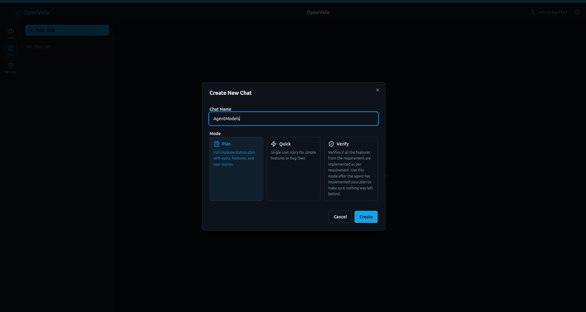](images/tutorial/02_01_CreateChat.png)

### 2.2 Automated Repository Analysis
The planning engine automatically enters the **Analyzing** stage. It scans the OpenVelo repository files, identifies directory structures, and outputs a complete project orientation guide (`REPOSITORY.md`).

[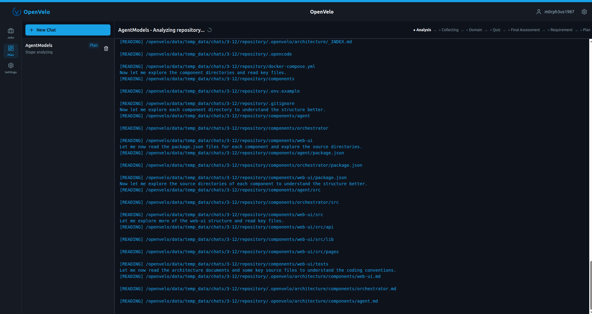](images/tutorial/02_02_Analysis.png)

### 2.3 Collecting Feature Scope
The engine transitions to the **Collecting** stage. It welcomes you and prompts you to describe the new feature you want to build inside OpenVelo.

[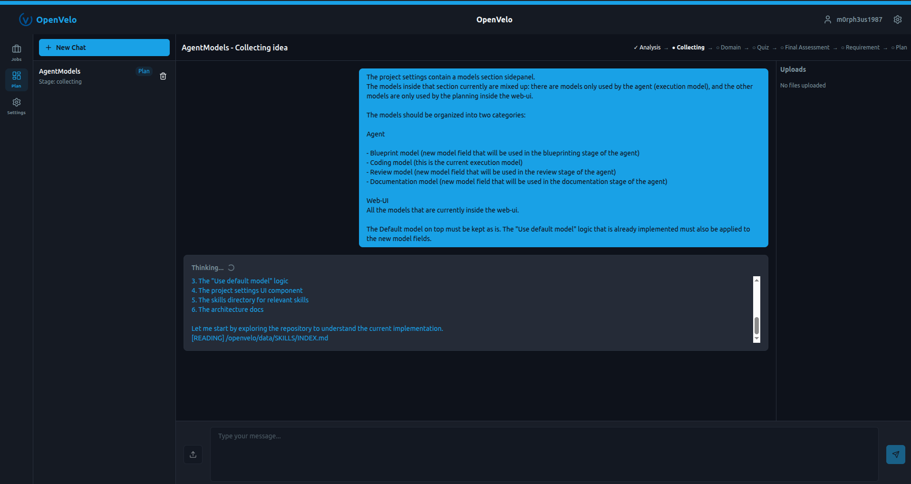](images/tutorial/02_03_InitialMessage.png)

### 2.4 Refining the Specification
To narrow down the requirements, the AI presents you with structured questions and recommended options. You can click on recommended selections to quickly define implementation parameters.

[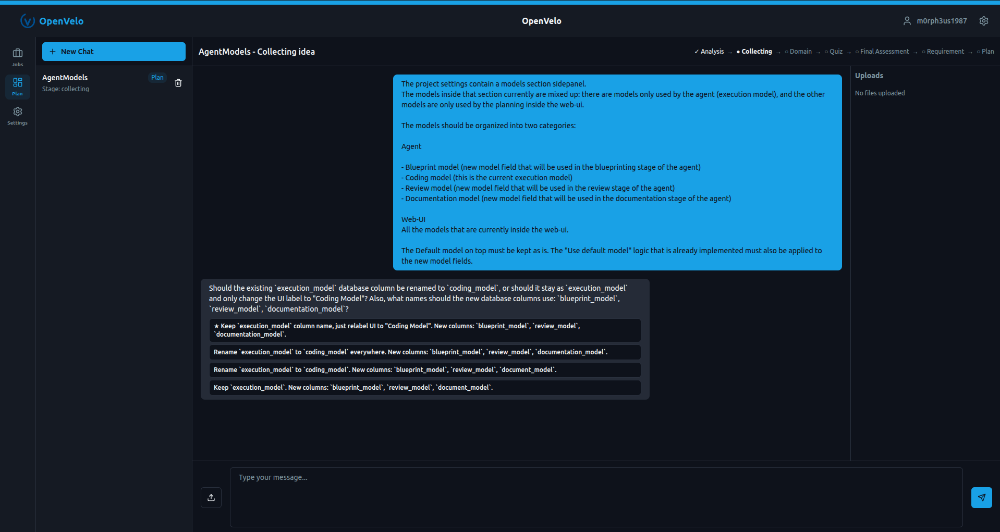](images/tutorial/02_04_Questions.png)

### 2.5 Identifying Architectural Domains
Once high-level requirements are finalized, the state machine transitions to the **Domain Planning** stage to evaluate how this feature impacts OpenVelo's internal components.

[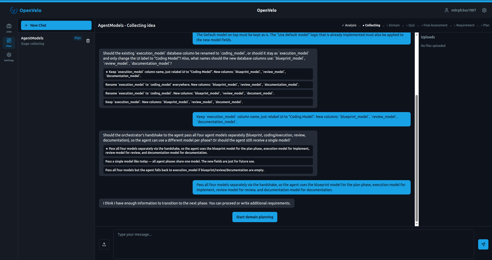](images/tutorial/02_05_TransitionToDomain.png)

### 2.6 Deep-Dive Domain Q&A
The AI identifies the specific architectural domains affected (e.g., the Express API, SQLite DB schema, React UI, or Agent prompt files) and asks codebase-driven technical questions to plan the changes.

[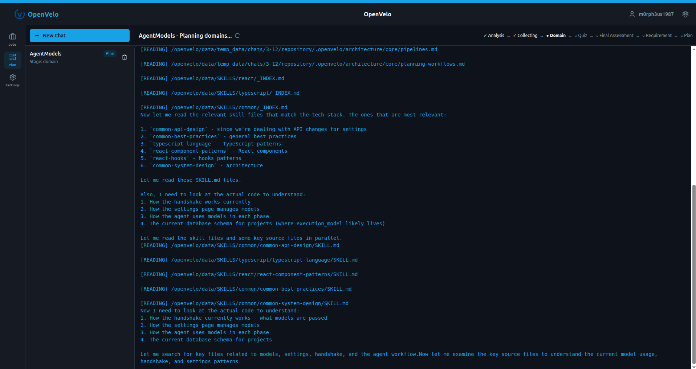](images/tutorial/02_06_DomainPlan.png)

### 2.7 Verification & Quiz Stage
To prevent logical errors, the AI enters the **Quiz** stage, challenging the collected information and probing for missing edge cases or technical contradictions.

[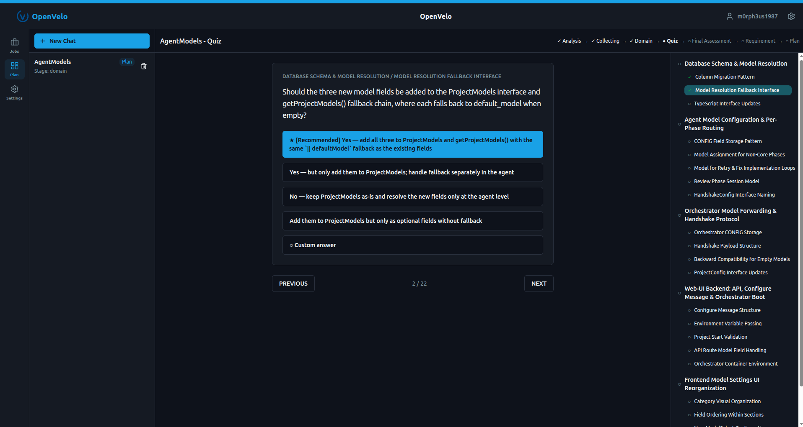](images/tutorial/02_07_Quiz.png)

### 2.8 Entering Custom Technical Details
You can select pre-filled options or write custom, highly specific instructions for the agent to follow during the implementation.

[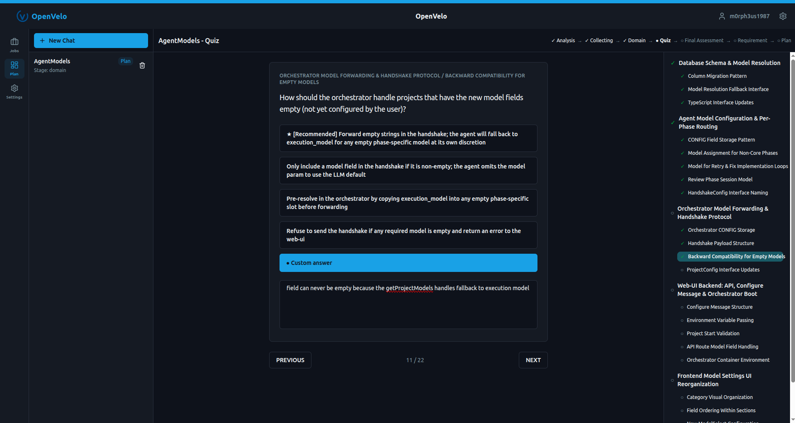](images/tutorial/02_08_QuizCustom.png)

### 2.9 Final Architectural Assessment
The engine compiles a comprehensive review of all collected details and asks final clarifying questions to resolve any remaining gaps or ambiguities.

[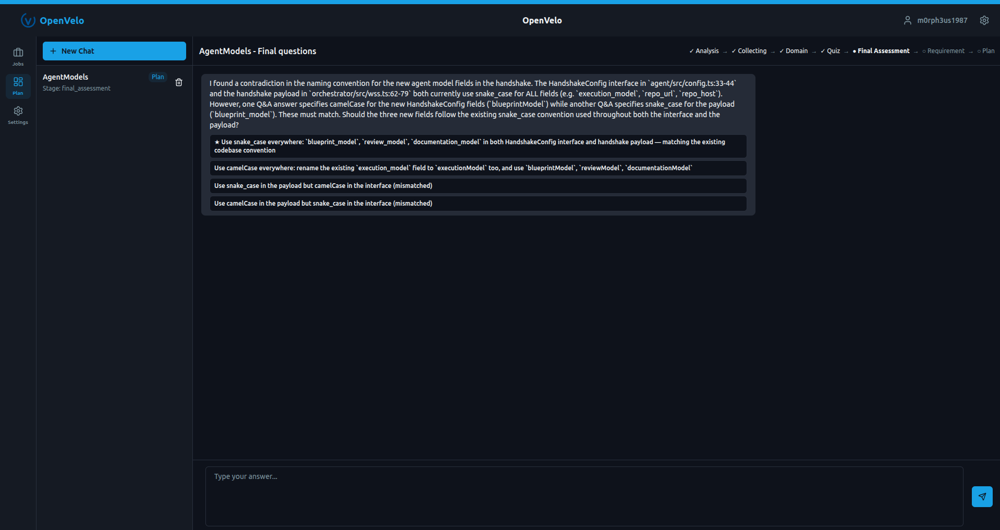](images/tutorial/02_09_FinalAssessment.png)

### 2.10 Compiling the Requirements Document
Once full alignment is reached, click **Generate Requirement** to synthesize the collected knowledge into a formal specification.

[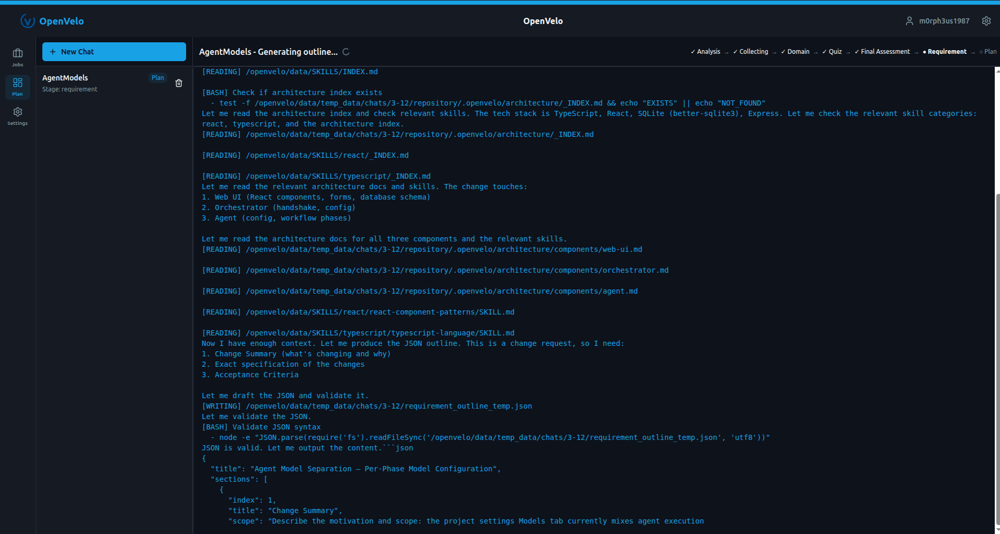](images/tutorial/02_10_GenerateRequirement.png)

### 2.11 Reviewing the Structured REQUIREMENT.MD
OpenVelo outputs a pristine, production-grade `REQUIREMENT.MD` covering functional specifications, UI changes, database schema modifications, and non-functional goals.

[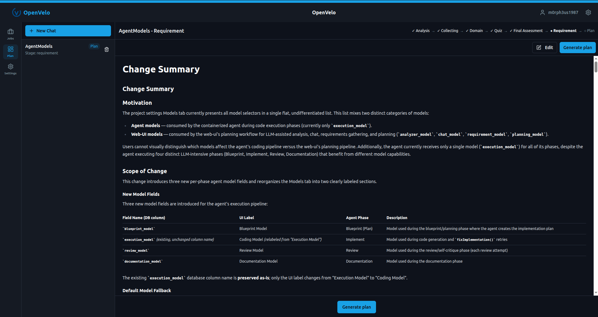](images/tutorial/02_11_Requirement.png)

### 2.12 Backlog Extraction
The planning model automatically extracts a highly detailed backlog of Epics, Features, and individual User Stories to implement the requirements step-by-step.

[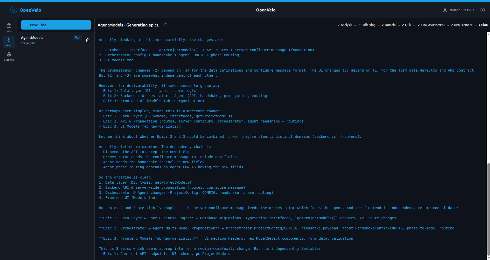](images/tutorial/02_12_GeneratingEpics.png)

### 2.13 Inspecting the Sequential Backlog Graph
Review the generated backlog, which shows strictly ordered dependencies between Epics to prevent merge conflicts. Click **Push Plan** to deploy this backlog to your project execution dashboard.

[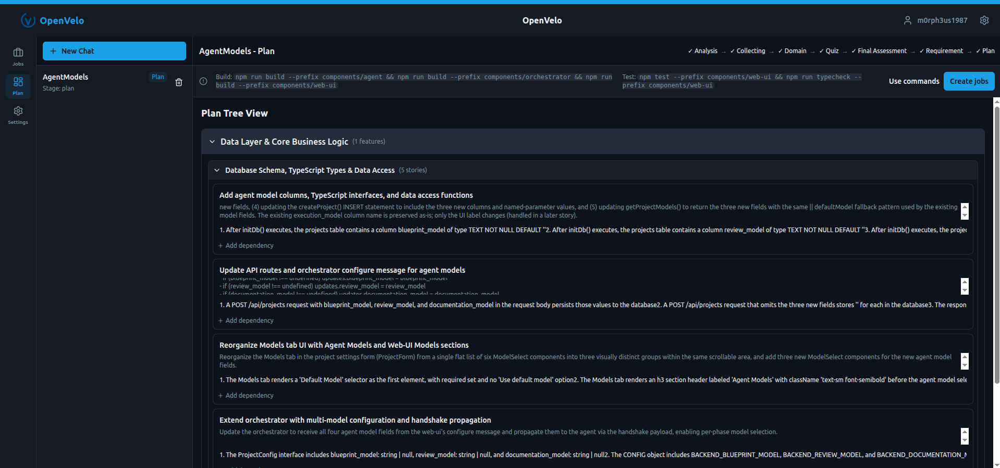](images/tutorial/02_13_Plan.png)

---

## Step 3: Job Execution & Agent Orchestration

With the backlog pushed to the dashboard, we can start the Orchestrator to dispatch individual coding tasks to containerized AI agents.

### 3.1 Pushed Job Queue
The execution dashboard loads the user stories, displaying prerequisite dependencies and active queue slots in real time.

[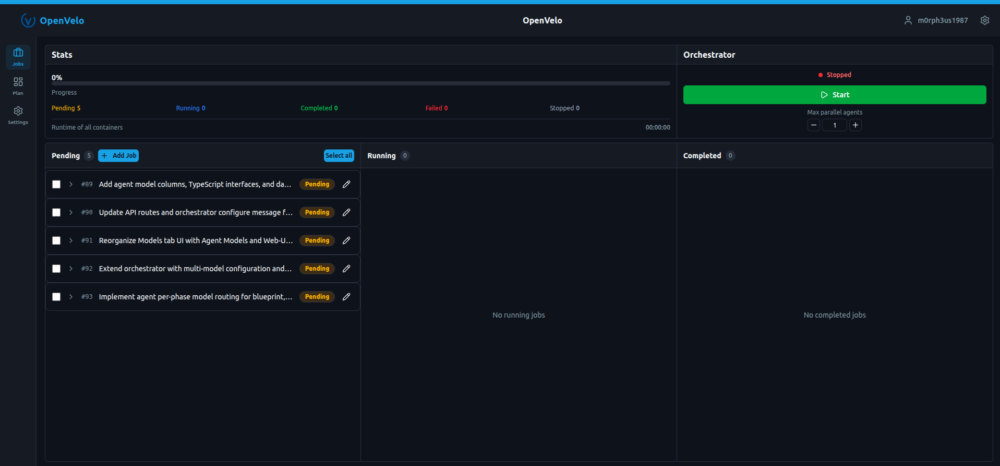](images/tutorial/03_00_JobList.png)

### 3.2 Spawning Agent Containers
Start the execution. The Orchestrator maps network modes and mounts, launches a dedicated container for the active job, clones the OpenVelo codebase inside it, and streams live terminal logs directly to your dashboard.

[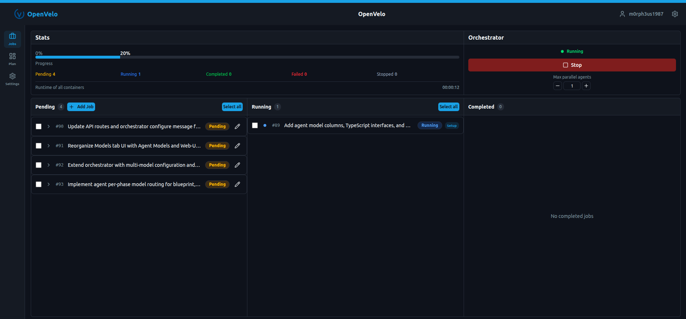](images/tutorial/03_01_Running.png)

### 3.3 Monitoring Container Metadata
Click on the active job card to view runtime metrics, dynamic container IDs, current pipeline stages, and active container retry loops.

[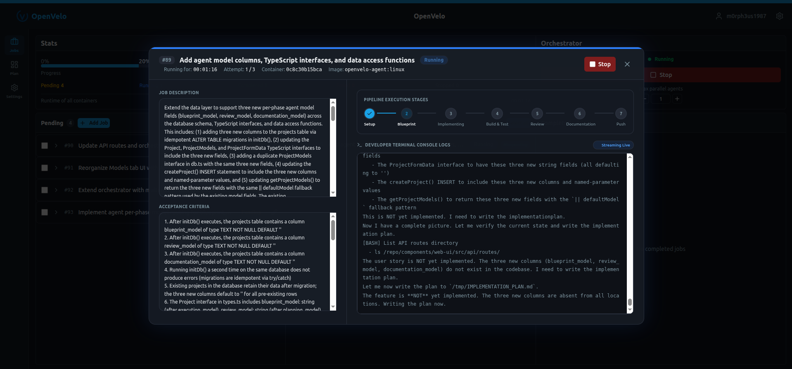](images/tutorial/03_02_JobCard.png)

### 3.4 Self-Healing Code Review & Unit Testing
Inside the container, the agent writes code edits, executes self-tests, and verifies compilation. If tests or builds fail, the agent's self-healing loop corrects the code. Once the build is verified, a separate LLM session runs a rigorous diff critique during the **Review** stage before pushing.

[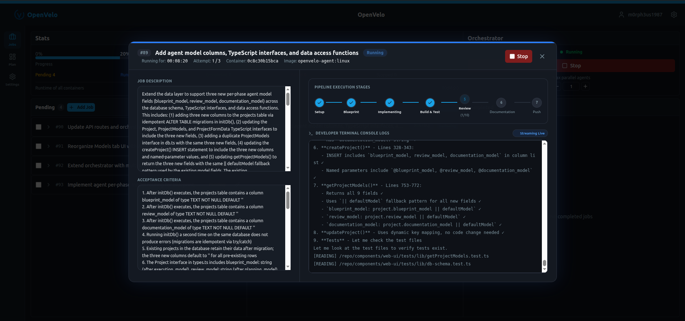](images/tutorial/03_03_Reviewing.png)

### 3.5 Job Completion & Documentation Update
Once the code and unit tests pass review, the agent runs its **Documenting** phase—automatically discovering modified files and updating architectural guides inside `.openvelo/architecture/`—before committing and transitioning the job to `COMPLETED`.

[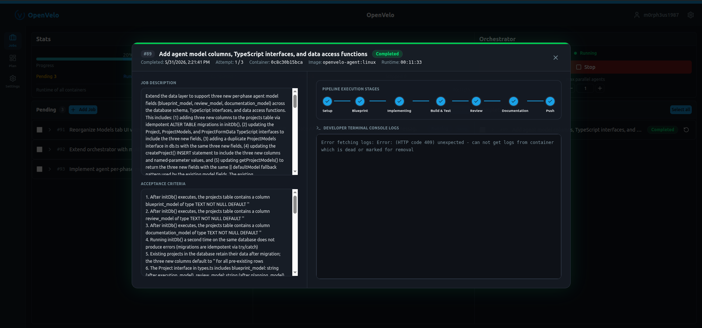](images/tutorial/03_04_Complete.png)

### 3.6 Automated Progression
Upon a job's completion, the Orchestrator evaluates the dependency tree, identifies the next unlocked job, and spawns the next agent container automatically.

[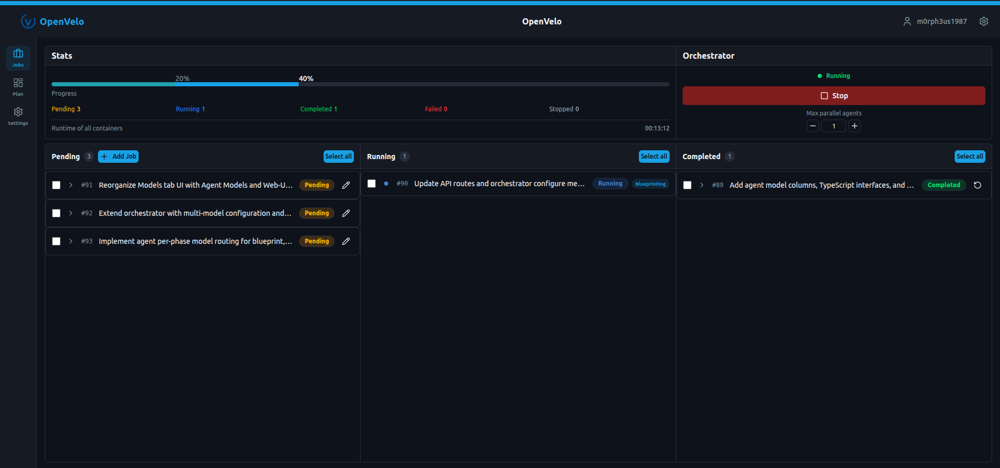](images/tutorial/03_05_Next.png)

---

## Step 4: Merging the Production-Ready Pull Request

After the agent pushes its final commits, a pull request is opened and managed on your configured repository host (e.g. Gitea).

### 4.1 Pushed Changes inside Gitea
Navigate to Gitea to review the pull request. The agent's branch contains clean code edits, unit test adjustments, and updated architectural markdown documentation delivered directly back into the OpenVelo project!

[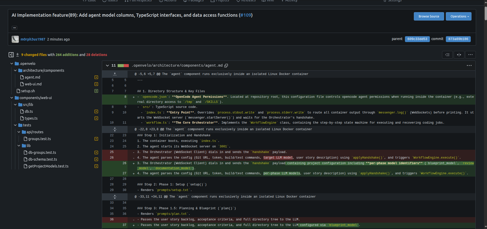](images/tutorial/04_01_Commit.png)

---
*Congratulations! You have completed the step-by-step guide. OpenVelo has successfully planned, built, tested, and pushed feature modifications directly back into its own codebase.*
